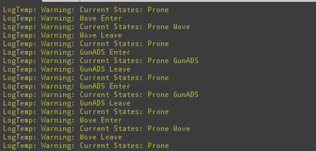
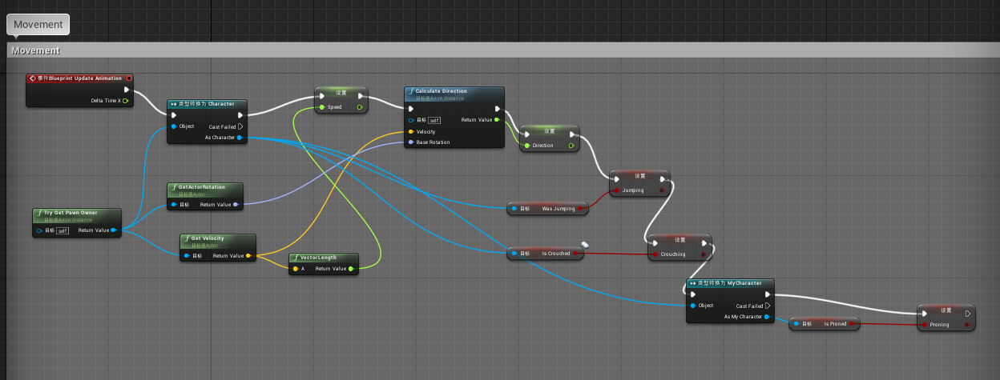
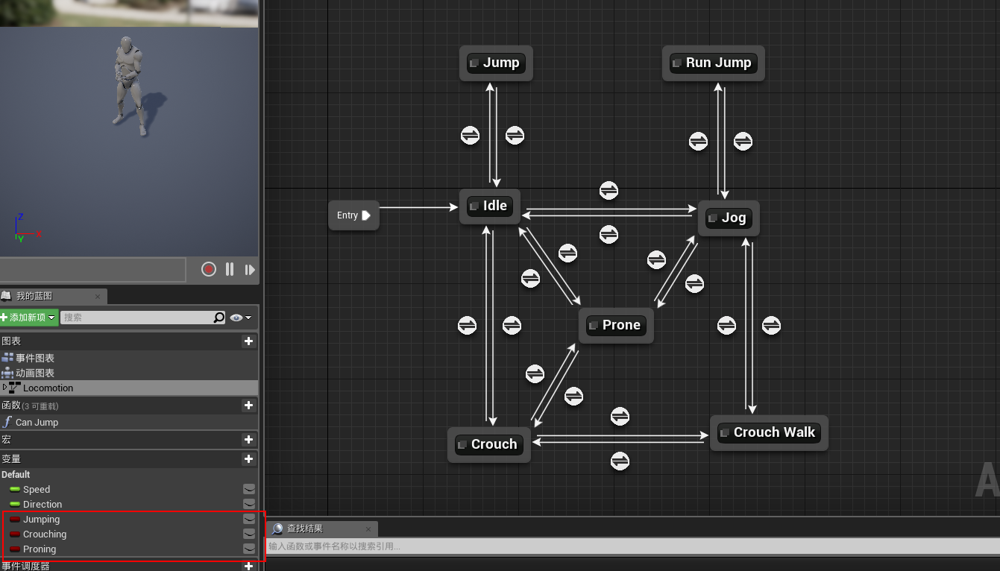

# 分层有限状态机(HFSM)设计思路


## 1. MyCharacter

 - 首先需要设计自己的character类，在该类中绑定输入及对应操作。
```
class QUICISTART_API AMyCharacter : public ACharacter
```
 - 同时该类还需要包含一个UStateManager类来管理状态机
```
UStateManager* StateManager;
```
 - 当特定输入触发时，将调用StateManager的对应方法来切换状态。

## 2. BaseState

 - BaseState类是所有状态的基类，继承于UActorComponent，拥有并重载了其BeginPlay()及TickComponent()方法，实现了Enter()和Leave()方法。
 - 同时还维护了一个成员变量用来记录状态名，一个用来记录状态枚举类
```
FString StateName;
StateEnum StateType;
```

## 3. 继承自BaseState的子状态
 - 所有状态都继承BaseState，并在自己的构造函数中对状态名和枚举变量进行定义。
```
UStandState::UStandState()
{
	StateName = FString("Stand");

	StateType = StateEnum::STAND;
}
```
 - 目前一共有Stand，Crouch，Prone，Move，GunADS五种状态类


## 4. StateManager
 - StateManager负责管理角色所有状态之间的切换，是character的成员变量。
 - StateManager含有TSet成员变量记录当前的所有状态，并维护了一个常量状态互斥表StateTable，以及一个特殊条件表Conditions。
 - 实践时我注意到，要为想动态维护的变量加上UPROPERTY()，这些UBaseState对象才会被添加进UE4的GC系统引用中，否则将被创建于栈中而不被GC计数管理，指针随时可能失效。
```
	UPROPERTY()
		TSet<UBaseState*> CurrentStates;

	// 	MOVE, STAND, CROUCH, PRONE, JUMP, GUN_FIRE, GUN_ADS
	const FString StateTable[7][7] = {
			{ "XY", "XY", "XY", "XY", "XY", "XY", "XY" },
			{ "XY", "XY", "_Y", "_Y", "XY", "XY", "XY" },
			{ "XY", "_Y", "X_", "_Y", "XY", "XY", "XY" },
			{ "XY", "_Y", "_Y", "XY", "XY", "XY", "XY" },
			{ "XY", "XY", "X_", "X_", "XY", "XY", "X_" },
			{ "XY", "XY", "XY", "XY", "XY", "XY", "X_" },
			{ "XY", "XY", "XY", "XY", "_Y", "XY", "XY" }
	};

	TMap<StateEnum, TArray<TMap<FString, FString>>> Conditions;
```        
 - AddState方法是根据枚举变量添加状态的方法。
	- 需要先检查是否已经存在该状态，以及当前状态是否为空等
	- 接着根据特殊条件Conditions进行检查判断，对特殊情况进行操作。
```
	// check conditions
	for (auto& Elem : Conditions)
	{
		if (CurrentStates.Find(GetStateObject(Elem.Key)))
		{
			TArray<TMap<FString, FString>> array = Elem.Value;
			for (auto& r : array) {
				StateEnum from = (StateEnum)FCString::Atoi(*r["from"]);
				StateEnum to = (StateEnum)FCString::Atoi(*r["to"]);
				FString s = r["relation"];
				if (CurrentStates.Find(GetStateObject(from)))
				{
					if (AddStateType == to)
					{
						if (!HasX(s))
						{
							RemoveState(from);
						}
						if (HasY(s))
						{
							UBaseState* state = GetStateObject(to);
							CurrentStates.Add(state);
							state->Enter();
						}
						ShowCurrentStates();
						return;
					}
				}
			}
		}
	}
```
 - 
	- 接着根据互斥表处理通常情况
	- 这里注意不能在变量一个容器的过程中对其进行增删操作，否则会引起容器长度改变的异常。正确的方法是用另一个容器或变量进行标记，遍历完后再进行处理。
```
	TArray<StateEnum> ToBeRemoved;
	bool NeedAdd = false;
	for (auto& State : CurrentStates)
	{
		FString s = StateTable[(int)State->StateType][(int)AddStateType];
		if (!HasX(s))
		{
			ToBeRemoved.Add(State->StateType);
		}
		if (HasY(s))
		{
			NeedAdd = true;
		}
	}
	for (auto& StateType : ToBeRemoved)
	{
		RemoveState(StateType);
	}
	if (NeedAdd)
	{
		UBaseState* state = GetStateObject(AddStateType);
		CurrentStates.Add(state);
		state->Enter();
	}
	ShowCurrentStates();
```


 - 特殊状态(伏地开镜状态下添加移动状态时，必须删除开镜状态) 成功地进行了处理。


## 5. 动画
 - 使用市场上的免费资源Starter Animation pack中的模型及动画资源。
 - 修改原本的动画蓝图类的事件图表来响应蹲跑跳。

 - 设置动画状态机。Speed, Direction, Jumping, Crouching, Proning 等变量用来控制状态之间的转换。

 - Character自带Jump和Crouch的方法，同时有表示状态的bool值变量，可以直接在状态类用来控制状态机的转变。
 - Character不包含Prone的方法，自己实现，通过控制bIsProned变量来控制Prone状态的转变。
 - 注意在状态类中需要保持对Character的引用，而Character又包含StateManager，StateManager又包含各个状态类，如果简单包含头文件会引起循环引用的错误，因此需要在状态类的头文件中超前引用Character。之后再在cpp文件中#include Character的头文件。
```
class AMyCharacter;
```

## 遗留问题
 - 趴地是Capsule无法旋转，只能设置大小位置。
 - 持枪瞄准方向动作。
 - 开镜动作和其他动作的结合。
 - 伏地开镜移动后，在停止移动时无法恢复到开镜的状态。
 - 特殊状态表在c++下书写十分困难，在json或lua中情况会好转。